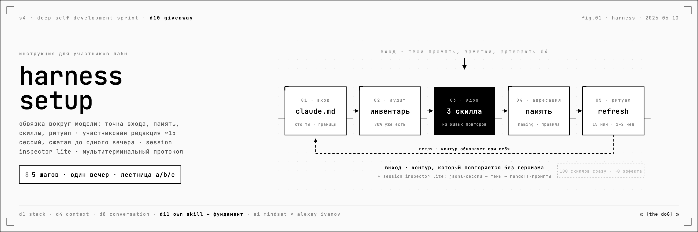
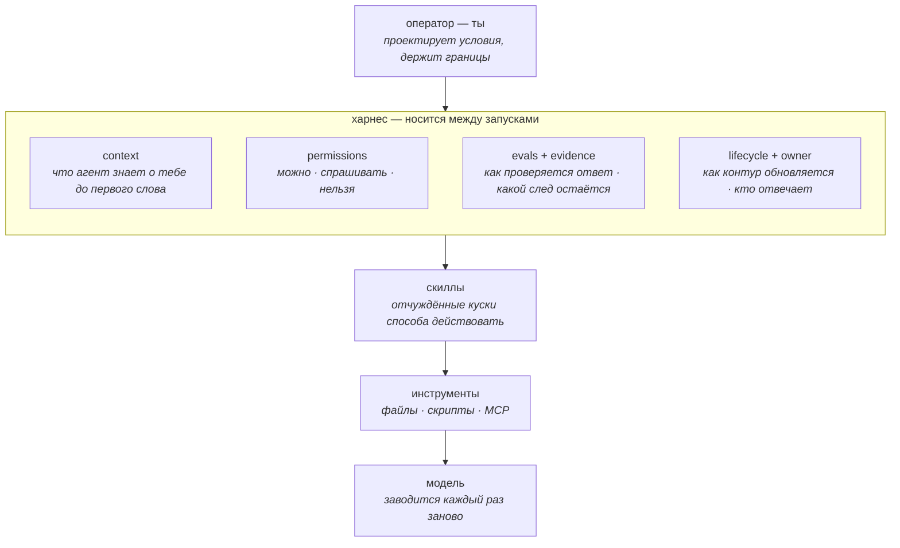
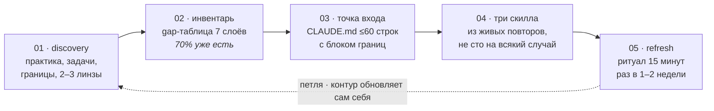

# harness setup · selfdev



Личный AI-харнес для практики саморазвития: что это, как устроено, как собрать свой за вечер.

```
агент = модель + харнес
```

**Harness** — слово ремесленное: упряжь, обвязка, в которой чужая сила превращается в работу. Модель (Claude, GPT, любая) вы «заводите» каждый раз заново. Харнес — то, что вы носите с собой между запусками: файл-точка входа, память, скиллы, правила, границы. Он переживает смену моделей.

Этот репозиторий — публичная версия материала из self-dev лаборатории AI Mindset (июнь 2026): большой скилл-проводник, библиотека линз, полный рабочий пример и дашборд-карта. **Личных данных здесь нет** — все примеры построены на синтетическом участнике «м.», выдуманном от первой строки до последней.

---

## Как устроено · семь слоёв

Каждый слой отвечает на один вопрос. По отдельности слои почти ничего не решают: промпт без памяти забывает, память без прав опасна, права без следа превращаются в декларацию. Контур начинается, когда слои замкнуты.



Фигура над контуром — **оператор**. Commander знает, куда вести, и раздаёт команды. Operator проектирует условия, в которых действие случается правильно — и без него. Весь сетап ниже — про один сдвиг: от «как правильно попросить» к «какой контур должен существовать без меня».

## Как работает · пять стадий за вечер



Каждая стадия — вопросы плюс артефакт на выходе. Все промпты для прохождения лежат в [SKILL.md](SKILL.md) — копируй и вставляй. Заполненный пример каждого артефакта — в [examples/](examples/README.md).

Отдельные главы скилла: **session inspector lite** (ваши сессии Claude Code лежат в `~/.claude/projects/` как jsonl — один промпт собирает из них обзор тем с handoff-промптами) и **мультитерминальный протокол** (окно = задача · handoff на половине контекста · субагенты только для ресёрча · координация через файлы).

## Как запустить

**Уровень A — Claude Code / Codex CLI.** Скопируй скилл и попроси агента провести тебя:

```bash
git clone https://github.com/aPoWall/harness-setup-selfdev
mkdir -p ~/.claude/skills/harness-setup-selfdev
cp harness-setup-selfdev/SKILL.md ~/.claude/skills/harness-setup-selfdev/
# в Claude Code: «собери мой harness по скиллу harness-setup-selfdev, стадия 1»
```

**Уровень B — любой чат-бот.** Открой [SKILL.md](SKILL.md), вставляй промпты стадий по одному, артефакты складывай в заметки руками.

**Уровень C — без AI.** Naming convention, план развития, ритуал refresh и карта границ работают на бумаге.

Заметки в Notion / Roam / на бумаге — не блокер: файлы контура создаются в любой локальной папке, фрагменты заметок копируются в чат руками.

## Что внутри

| файл | что это |
|------|---------|
| [SKILL.md](SKILL.md) | скилл-проводник: 7 слоёв, 5 стадий с промптами, карта «практика → скилл → данные», session inspector lite, мультитерминальный протокол |
| [frameworks-digest.md](frameworks-digest.md) | 116 линз саморазвития / 8 семей (IFS, журналинг, OKR, випассана…) с ai-петлёй и практикой недели по каждой + что реально использует когорта |
| [examples/](examples/README.md) | **возможный результат целиком**: синтетический участник «м.» от discovery до лога первой недели |
| [docs/index.html](docs/index.html) | дашборд-карта: слои, стадии с прогрессом, блоки сетапа, копируемые промпты |

## Возможный результат

Из [examples/week-1-log.md](examples/week-1-log.md) — что контур произвёл за первую неделю:

> | цель | статус | факт |
> |------|--------|------|
> | разгрузить решения | ◐ | было 9 открытых → стало 6; одно ревью просрочено |
> | трудный разговор | ◐ | письмо отправлено, разговор назначен на вторник |
> | медитация | ✗ | 2/7 — оба раза после страниц, не «до телефона» |
>
> паттерн недели: «решения двигаются, когда у них есть дата; всё бездатное стоит»

Провал виден так же ясно, как успех — это и есть смысл слоя evidence. Трекинг опирается на факты-следы вместо ощущений.

## Privacy

- участник «м.» и участница «к.» — выдуманы; совпадения случайны;
- материал терапии в этой системе всегда `local-only · ask_first` — см. [examples/memory-rules.md](examples/memory-rules.md);
- контур ничего не отправляет наружу без явного подтверждения — это правило первой строки в каждом примере CLAUDE.md.

## Родственное

- [relationship-os](https://github.com/aPoWall/relationship-os) — пример продукта, выросшего на таком контуре: дашборд личных отношений поверх Telegram + Obsidian, синтетическое демо;
- selfdev compass — групповой слой спринта: паспорт → карта → раунды практики;
- публичная серия про харнес · скилл · оператор: [t.me/ai_mind_set/347](https://t.me/ai_mind_set/347).

## Лицензия

MIT. Делитесь свободно, упоминайте AI Mindset, если помогло. Существенные переработки — добавляйте свою провенанс-строку: способ действовать у каждого свой.
